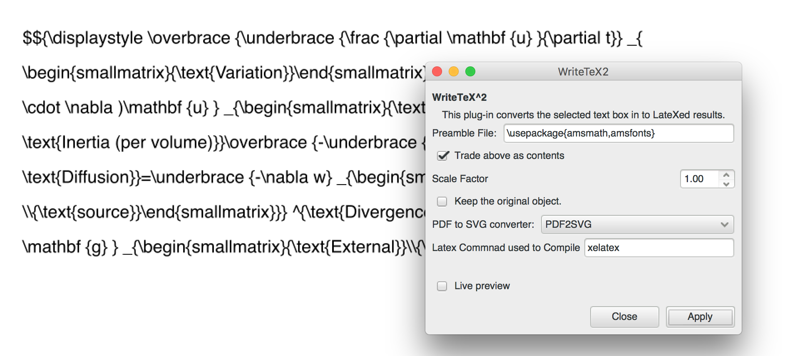
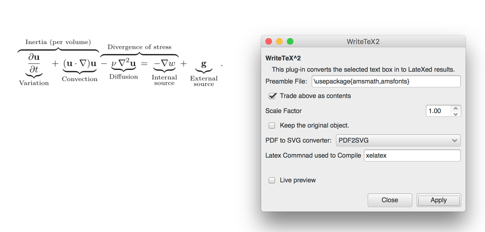
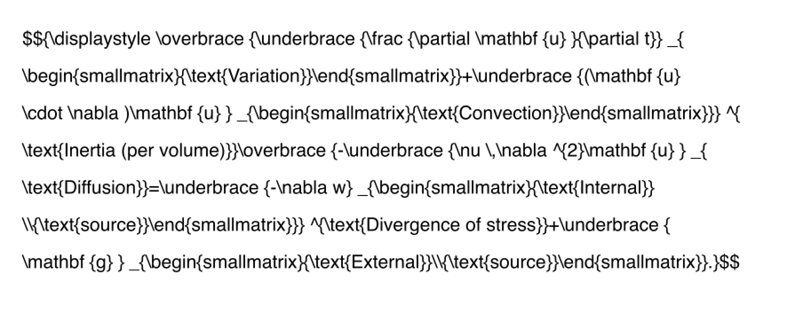
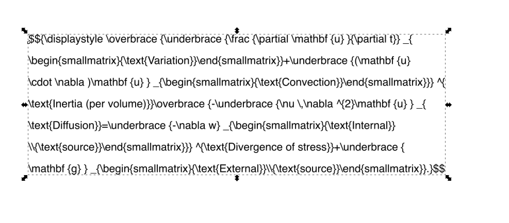
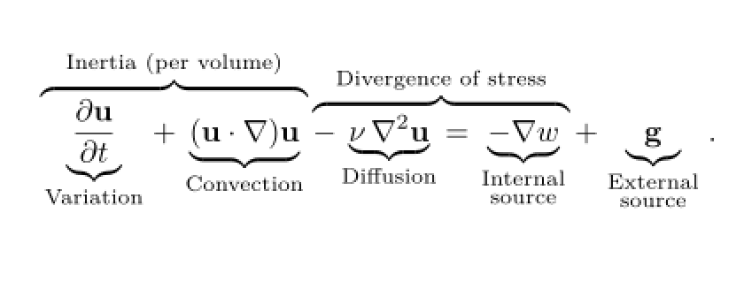

# WriteTeX2

Installation method is the same as WriteTeX. The extension will be shown under Extensions => Render => WriteTeX2. The idea of this extension is to change a text node to an equation, and change it back if it is already an equation. You may find the Previous Extension under Extensions menu useful when using this extension. Give it a try, and feedback how do you think about it.

## How to use it
Step 1. Input the TeX source into a text field, and open WriteTeX2 extension.

Step 2. Select the text field and click Apply.

These two steps will provide you all functionalities, if you only need to do get a specific equation. If you want to edit and input more equations, the following contents may come handy.

Step 3. After you close the dialog, if you do not use other extension, then you can use Previous Extension (OPTION+Q in MacOSX and Alt+Q in Windows) to edit your equation and make new ones. If you select the equation, and press OPTION+Q or Alt+Q, you can get back the text field.

Make necessary changes to the text field and select it

Press OPTION+Q or Alt+Q again, and the equation is back

BTW, I am not an active user of WriteTeX because the scope of my current job is not quite related. Feel free to make PRs to improve this extension.

Have a great day, and happy drawing!

2019-04-19
